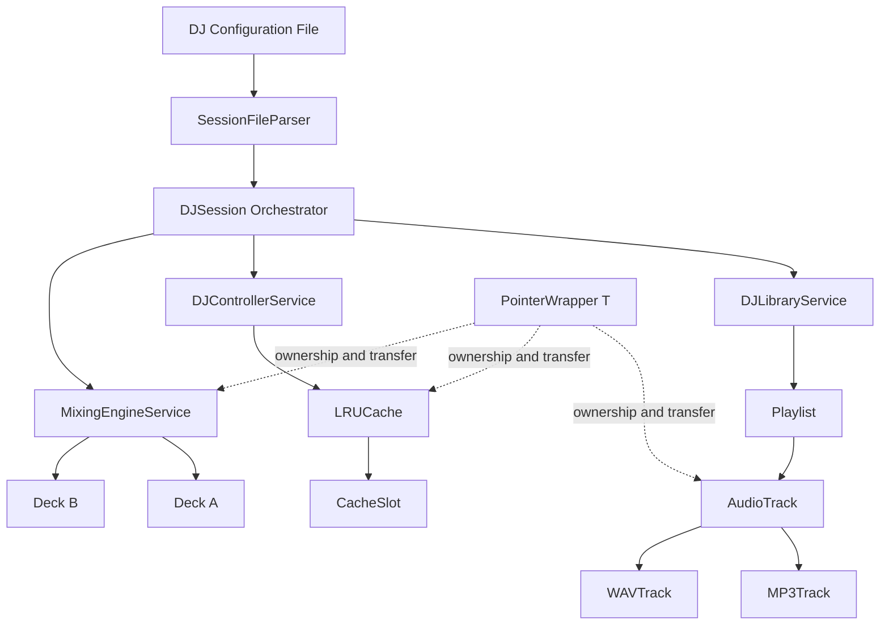

# DJ Track Session Manager


A console-based C++ simulation of a DJ session system, focused on **manual memory management**, **ownership semantics**, **polymorphism**, and **service-oriented design**.

The system builds a music library from a configuration file, creates playlists, caches tracks using an LRU policy, loads cloned tracks onto two simulated decks, performs BPM compatibility checks, and reports session statistics.

> This project simulates track management and analysis. It does not decode or play real audio.

## Highlights

- Manual resource management with clear ownership boundaries
- Complete **Rule of Five** implementation for dynamically allocated waveform data
- Polymorphic `MP3Track` and `WAVTrack` classes
- Deep copying through a virtual `clone()` interface
- Custom move-only `PointerWrapper<T>` based on RAII principles
- Playlist implemented as an owned linked list
- Fixed-capacity **LRU cache** with hit, miss, and eviction tracking
- Two-deck mixing simulation with automatic BPM synchronization
- Configuration-driven track library and playlists
- Interactive and automatic session modes
- Debug, release, and Valgrind targets through `Make`

## Architecture



## Core Components

### `AudioTrack`, `MP3Track`, and `WAVTrack`

`AudioTrack` owns a dynamically allocated waveform buffer. Its copy and move operations implement the Rule of Five so tracks can be copied, moved, and destroyed safely.

The derived classes provide format-specific behavior for:

- Track loading
- Beat-grid analysis
- Quality scoring
- Polymorphic cloning

### `Playlist`

A custom linked-list playlist that owns its nodes and track objects. It supports:

- Adding and removing tracks
- Searching by title
- Deep-copy construction and assignment
- Duration calculation
- Ordered track access

### `PointerWrapper<T>`

A custom move-only owning pointer wrapper inspired by unique-ownership smart pointers. It provides:

- Automatic deletion through RAII
- Deleted copy operations
- Move construction and move assignment
- `get()`, `release()`, and `reset()`
- Dereference and member-access operators

### `LRUCache` and `DJControllerService`

The controller stores independent polymorphic track clones in a fixed-capacity cache. Recently accessed tracks remain available, while the least recently used track is evicted when capacity is reached.

Cache operations distinguish between:

- Cache hit
- Cache miss
- Cache miss with eviction

### `MixingEngineService`

Simulates two DJ decks and manages the lifecycle of cloned tracks loaded for mixing.

It supports:

- Alternating between Deck A and Deck B
- Format-specific loading and beat analysis
- BPM compatibility checks
- Optional automatic BPM synchronization
- Safe cleanup of deck-owned tracks

### `DJSession`

The main orchestrator coordinates configuration loading, library construction, playlist processing, cache access, deck loading, and statistics collection.

The final summary reports:

- Tracks processed
- Cache hits and misses
- Cache evictions
- Loads per deck
- Transitions
- Errors

## Ownership Model

The project deliberately uses several ownership strategies to demonstrate safe resource handling:

- `AudioTrack` owns its waveform buffer.
- `Playlist` owns its linked-list nodes and the track clones stored in them.
- `DJLibraryService` owns the canonical library tracks.
- `LRUCache` owns independent cloned tracks through `PointerWrapper<AudioTrack>`.
- `MixingEngineService` owns the tracks currently loaded on its decks.
- `clone()` preserves the concrete runtime type when creating independent copies.

These boundaries prevent accidental shared ownership, dangling pointers, double deletion, and memory leaks.

## Project Structure

```text
.
├── .devcontainer/       # Reproducible VS Code development environment
├── include/             # Header files
├── input_2/
│   └── dj_config.txt    # Example library, cache, mixing, and playlist configuration
├── src/                 # C++ implementations
├── Makefile             # Build, run, debug, and Valgrind targets
└── README.md
```

The generated `bin/` directory is intentionally excluded from version control.

## Build and Run

### Recommended: VS Code Dev Container

1. Open the repository in Visual Studio Code.
2. Run **Dev Containers: Reopen in Container**.
3. Build the project:

```bash
make
```

4. Copy the example configuration to the runtime directory:

```bash
cp input_2/dj_config.txt bin/dj_config.txt
```

5. Run all configured playlists:

```bash
./bin/dj_manager -I -A
```

### Local Linux or WSL

Requirements:

- `g++`
- `make`
- A C++11-compatible environment
- `valgrind` for leak checking

```bash
make
cp input_2/dj_config.txt bin/dj_config.txt
./bin/dj_manager -I -A
```

## Useful Commands

```bash
make             # Build the project
make debug       # Build with DEBUG enabled
make release     # Build with NDEBUG enabled
make test        # Build and run the application
make test-leaks  # Run the application through Valgrind
make clean       # Remove generated object files and executable
make help        # Display available Make targets
```

Before `make test` or `make test-leaks`, ensure that `bin/dj_config.txt` exists:

```bash
cp input_2/dj_config.txt bin/dj_config.txt
```

## Configuration

The example configuration controls:

- Application metadata
- MP3 and WAV track definitions
- Artists, duration, BPM, and format-specific properties
- Controller cache capacity
- BPM tolerance
- Automatic synchronization
- Playlist definitions using track indices

Edit `input_2/dj_config.txt`, then copy it into `bin/` before running.

## Memory Verification

To rebuild and check the program with Valgrind:

```bash
make clean
make
cp input_2/dj_config.txt bin/dj_config.txt
make test-leaks
```

The project was designed around explicit ownership and leak-free cleanup across playlists, waveform buffers, cached clones, library objects, and deck transitions.

## Academic Context

Developed as a Systems Programming course project at Ben-Gurion University.

The assignment supplied parts of the infrastructure and configuration parsing. The implementation work focused on memory ownership, the Rule of Five, polymorphic track behavior, the custom pointer wrapper, playlist management, LRU caching, service integration, deck management, and session orchestration.
